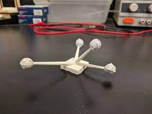

# OptiTrack Prime 13x System
> :warning: This wiki is still very much a work in progress. If you feel that some information is misleading or missing, feel free to create it and make a PR.

## Table of Contents
- [Introduction](#introduction)
- [Usage](#usage)
  - [Network](#network)
  - [Motive](#motive)
  - [Calibration](#calibration)
  - [Data streaming](#data-streaming)
  - [FAQ](#faq)

## Introduction
OptiTrack is a motion capture system that can be used for tracking objects with a sub-millimetre accuracy. The system is based on the reflection of a specific wavelength of IR light emitted from cameras, which is reflected from the reflective markers, that can be seen in the figure below. The reflected light is picked up by cameras and markers 3D coordinates are triangulated in the Motive software. 

<table>
  <tr>
    <td><b>Markers</b></th>
    <td><b>Cameras Prime 13x</b></th>
  </tr> 
  <tr>
    <td> </td>
    <td> </td>
  </tr> 
</table>

>[!Important]
> Be aware that the mocap system is only tracking the reflective markers or reflective colour/tape. 
>
>The markers can be either labelled, unlabelled, rigid body or marker set. The rigid body is a collection of markers. This can be set in Motive software, by selecting  `number of markers ⇒ right-click ⇒ rigid body`. The marker cannot change their position with respect to each other, since this is saved by the software to distinguish the specific rigid body
>
> Avoid using symmetric patterns, since it introduces uncertainty in the data received from OptiTrack.

<table>
  <tr>
    <td><b>Custom markers-reflective tape</b></th>
    <td><b>Custom marker template</b></th>
    <td><b>Rigid body markers </b></th>
  </tr> 
  <tr>
    <td> </td>
    <td> </td>
    <td> </td>
  </tr> 
</table>

## Usage
### Network
The OptiTrack system is connected according to the figure below. The OptiTrack software `Motive` is launched on the `Camera PC` computer that is connected to the lab WiFi. You cannot use the mocap system unless you are on the lab WiFi. Your PC is a client that connects to the `Camera PC` computer to receive poses of markers and rigid bodies.

### Motive
In the centre of the `Motive` software, you can see the view of the workspace, the placement of the cameras in the space and the coordinate system. You can limit the workspace (the blue cube) so that only the markers in this area will be taken into account. On the bottom and right part of the window, you can see the connected cameras. Here you can control the cameras, turn them on/off, adjust parameters or change the mode/video type. For measurements use mode/video type `object`. To check the field of view of each camera use mode MJPEG. On the left side, you can see the calibration option.

### Calibration
>[!Warning]
> The calibration should be done each time a camera has moved or each time you start a new experiment.

The calibration starts with masking. The masking will mask all the unwanted reflections(do not put your marker into the workspace during calibration). If the masking is done you continue to wanding. If you start a new experiment or move the cameras you should use full measurement, if you continue your experiment and the cameras have not moved you should get away with the refine option. After you click start winding, you have to take the calibration wand and go to the workspace of the cameras and collect the samples with the wand. You can see on each camera if enough samples are collected. The wanding should take at least 5 min and cover areas you are going to use for measurement. After you are done, click on calculate and the software calculates the accuracy of your measurement.

Next, you need to set your ground plane(coordinate system) using a calibration triangle by placing it where you want your ground plane.

### Data streaming
To use the data in ROS, MATLAB you have to stream the data from Motive to your PC. To set up the streaming in Motive, go to the `settings⇒ streaming ⇒NatNet⇒ enables`. Local Interface sets the IP address of the camera’s PC of the network that is going to be used for streaming. Set transmission type to `multicast`, and then select what is going to be streamed. If you only need a single rigid body, select only a rigid body. Lastly, the `command port`, `data port` and `Multicast interface` have to be the same in the Motive and in your client code. 

For ROS integration see  [this repo](https://github.com/ARM-Lab/mocap_optitrack). You need to set the same parameters in the `config/mocap.yaml` file as well. THESE PARAMETERS HAVE TO MATCH IN THE ROS AND MOTIVE (preferably use the ones in the figure above). For more details about the topics and functions see the GitHub repo.

## FAQ
1. How to turn on/off the cameras? 
- Turn on/off the Motive software and plug in/out the camera switch.

2. I can't see my IP address in Motive settings(Local interface).
- Restart Motive

3. I am not receiving any data on my ROS PC.
- Try disabling the firewall/antivirus on the camera PC

4. The cameras are hot to the touch, is that ok?
- The working temperature of the cameras is around 55 degrees and can get up to 65 degrees.

## ToDo
- MATLAB integration
- Python integration
